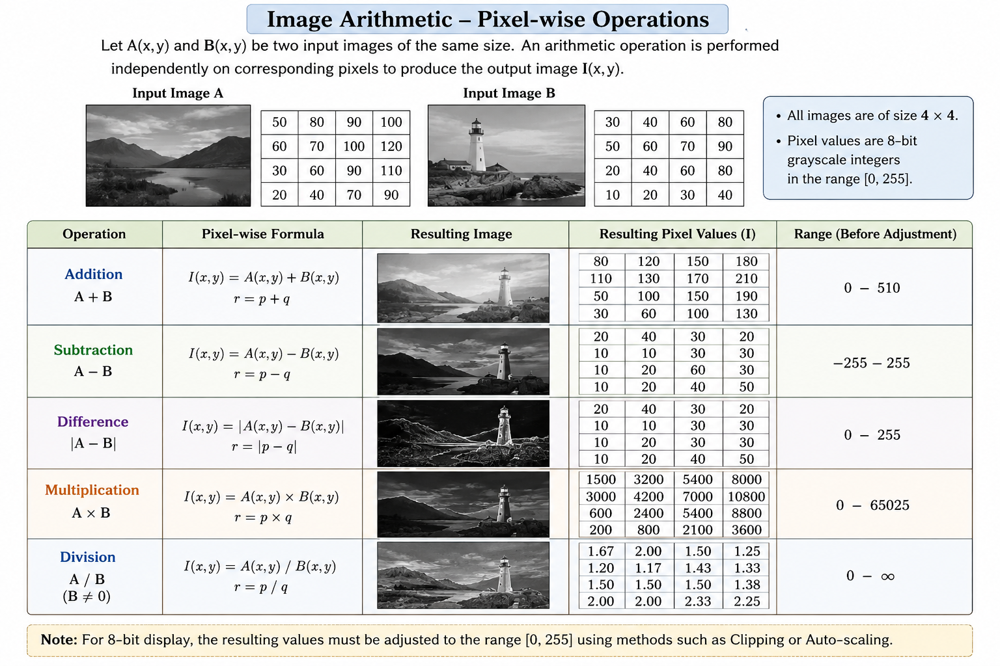

Image arithmetic refers to performing arithmetic operations on the pixel values of one or more images. These operations are useful for combining images, comparing images, and modifying or analysing image information.

Let \(A(x,y)\) and \(B(x,y)\) represent two input images, where \(x\) and \(y\) denote the pixel coordinates. An arithmetic operation between the two images can be represented as

$$
I(x,y) = A(x,y) \; o \; B(x,y)
$$

where \(o\) represents an arithmetic operation and \(I(x,y)\) is the resulting image.

For image arithmetic, the input images should generally have the same dimensions, \(M \times N\), so that corresponding pixels can be operated on directly.

### Pixel-wise Arithmetic Operations

Arithmetic operations are performed independently on corresponding pixels of the input images. Let

$$
p = A(x,y)
$$

and

$$
q = B(x,y)
$$

be the pixel values at the same location in the two input images. Let \(r = I(x,y)\) be the corresponding pixel value in the output image.

The basic arithmetic operations are addition, subtraction, difference, multiplication, and division.

_Figure 1: Pixel-wise arithmetic operations on two input images._

**Addition:**

$$
I(x,y) = A(x,y) + B(x,y)
$$

or

$$
r = p + q
$$

Addition combines the intensity values of corresponding pixels of the two images. It can be used, for example, to combine image information or to model the addition of noise to an image.

**Subtraction:**

$$
I(x,y) = A(x,y) - B(x,y)
$$

or

$$
r = p - q
$$

Subtraction determines the difference between corresponding pixel values. Since the order of the images matters, \(A-B\) and \(B-A\) can produce different results.

**Difference:**

$$
I(x,y) = \left|A(x,y) - B(x,y)\right|
$$

or

$$
r = |p-q|
$$

The difference operation uses the absolute value, so the output is always non-negative. It provides a measure of how different the corresponding pixels are in the two images.

**Multiplication:**

$$
I(x,y) = A(x,y) \times B(x,y)
$$

or

$$
r = p \times q
$$

Multiplication combines corresponding pixel values by multiplying them. The resulting values can become much larger than the values in either input image.

**Division:**

$$
I(x,y) = \frac{A(x,y)}{B(x,y)}
$$

or

$$
r = \frac{p}{q}
$$

Division computes the ratio between corresponding pixel values. The divisor must be non-zero because division by zero is undefined.

### Dynamic Range of an Image

A digital image stores pixel values within a limited range. For a \(b\)-bit image, the valid range is

$$
0 \leq r \leq 2^b-1
$$

For an 8-bit grayscale image, the valid pixel-value range is

$$
0 \leq r \leq 255
$$

However, the result of an arithmetic operation may fall outside this range. This creates an **underflow** when the result is less than the minimum allowed value and an **overflow** when the result is greater than the maximum allowed value.

For two 8-bit input images, the theoretical output ranges of the basic operations are:

- **Addition:**

$$
0 \leq r \leq 255+255 = 510
$$

- **Subtraction:**

$$
-255 \leq r \leq 255
$$

- **Difference:**

$$
0 \leq r \leq 255
$$

- **Multiplication:**

$$
0 \leq r \leq 255 \times 255 = 65025
$$

- **Division:**

The result depends on the value of the divisor and can become very large when the divisor is close to zero. Division by zero is undefined.

These ranges show why the result of an arithmetic operation cannot always be stored directly as an 8-bit image.

### Handling Values Outside the Valid Range

When an arithmetic operation produces values outside the valid pixel range, the output must be processed before it can be represented as an 8-bit image. Two commonly used approaches are **clipping** and **auto-scaling**.

**Clipping:**

In clipping, values below the minimum allowed value are set to the minimum, and values above the maximum allowed value are set to the maximum.

For an 8-bit image,

$$
r_c =
\begin{cases}
0, & r < 0 \\
r, & 0 \leq r \leq 255 \\
255, & r > 255
\end{cases}
$$

where \(r_c\) is the clipped output value.

Clipping preserves values that are already within the valid range but discards information beyond the lower and upper limits.

**Auto-scaling:**

Auto-scaling maps the range of the computed result to the valid range of the output image. For an 8-bit image, the result can be mapped to the range \([0,255]\).

Let \(r*{\min}\) and \(r*{\max}\) be the minimum and maximum values in the result of an arithmetic operation. The auto-scaled value \(r_a\) is given by

$$
r_a =
255 \times
\frac{r-r_{\min}}
{r_{\max}-r_{\min}}
$$

This transformation maps \(r*{\min}\) to \(0\) and \(r*{\max}\) to \(255\).

Auto-scaling is useful when the computed values have a wider or different range from the range required for display. However, it changes the numerical representation of the result by mapping the values to a new range.

### Understanding the Output

The output of an image arithmetic operation depends on both the selected operation and the pixel values in the input images. For example, addition can produce values greater than 255, subtraction can produce negative values, and multiplication can produce values much larger than either input value.

Therefore, understanding the valid pixel range is important when interpreting the resulting image. Clipping and auto-scaling provide different ways of converting the arithmetic result into a range suitable for an 8-bit image.

In this experiment, the effect of different arithmetic operations on image pixel values and on the dynamic range of the resulting image can be observed directly. This helps in understanding how simple arithmetic operations on pixel values can change the appearance and numerical representation of an image.
